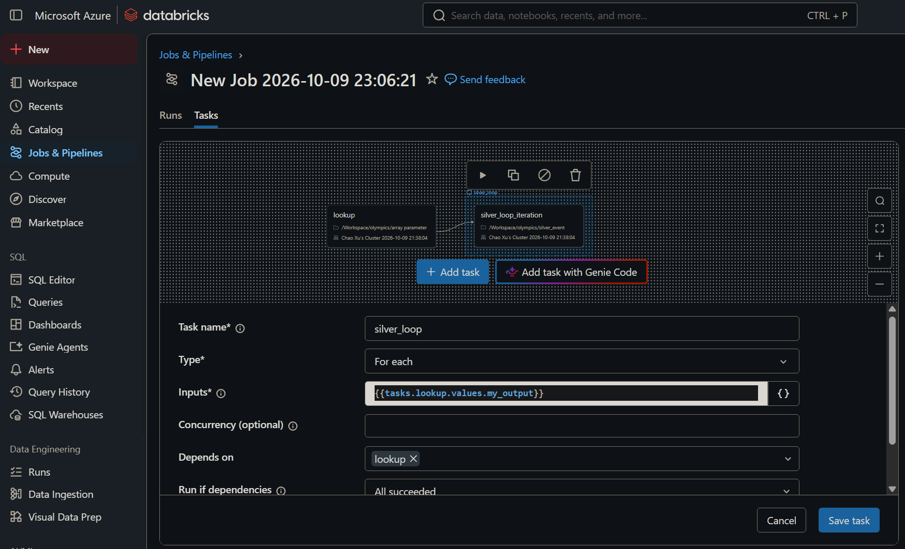
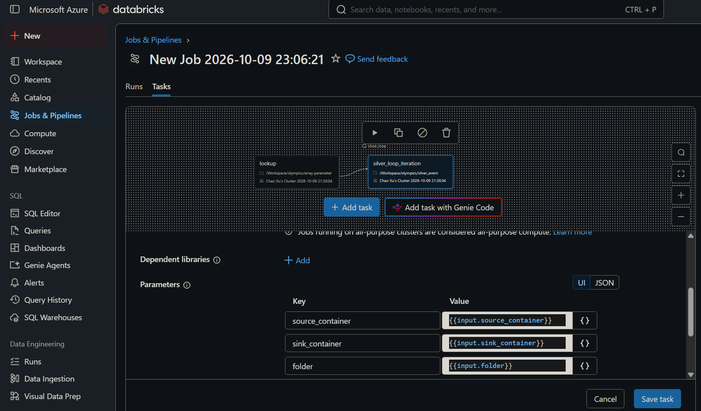

# ADF Metadata-Driven Batch File Loading

## Business Context

**Organization:** A Data Engineering team building an end-to-end data platform on Azure. The platform ingests raw data from multiple external sources (e.g., GitHub, APIs, on-premises databases) and follows the **Medallion Architecture (Bronze → Silver → Gold)** to progressively refine data for analytics and reporting.

**Problem:** The team has observed a growing issue of **code duplication and maintainability** when loading raw files into the Bronze layer. These issues create multiple challenges:

1. **Code Duplication**
   Creating a separate pipeline or dataset for every single file (e.g., `Dataset_Athletes`, `Dataset_Coaches`, `Dataset_Events`) leads to massive clutter in the ADF UI and unmaintainable code.

2. **Operational Rigidity**
   Adding a new file requires opening the ADF UI, modifying the pipeline or dataset, and republishing the entire factory. It cannot be done via a simple configuration change.

**Goal of this project:** Implement an end-to-end **metadata-driven batch copy mechanism** that uses an external JSON file as the manifest, combined with **Dataset-level parameterization**, to dynamically load multiple raw files into the **Bronze layer** with a single reusable pipeline. Downstream transformation into the **Silver** and **Gold** layers will be handled separately (e.g., via Databricks).

**How the goal addresses the problems:**
*   **Against Code Duplication**: Dataset-level parameters allow one single Dataset template to dynamically change its target path, eliminating the need for separate datasets per file.
*   **Against Operational Rigidity**: Because the file manifest is stored externally as a JSON file, adding or removing a file only requires editing the JSON — no changes to the ADF pipeline or dataset, and no republishing required.

**Architecture Overview (Medallion):**
*   **Bronze Layer (Implemented)**: Raw files are ingested from external sources into ADLS Gen2 via ADF. No transformation is applied at this stage.
*   **Silver Layer (Planned)**: Data will be cleaned, deduplicated, and standardized (e.g., via Databricks).
*   **Gold Layer (Planned)**: Business-level aggregations and metrics will be produced for reporting and analytics.

---

## 1. Core Logic Overview

This pattern implements a **metadata-driven** batch copy mechanism inside Azure Data Factory (ADF) without hardcoding file paths. It allows you to load multiple files dynamically using a single pipeline.

*   **The Configuration Layer**: An external JSON file stores the manifest of files to be processed (e.g., source URL path, target folder, target file name).
*   **The Iteration Layer**: A `Lookup` activity reads the JSON file, transforming it into an Array, which is then fed into a **`For Each` activity**.
*   **The Execution Layer**: Inside the loop, a single `Copy Data` activity dynamically processes the current item on every iteration.

### 1.1 The JSON Manifest Example

Below is an example of the external JSON configuration file used as the manifest:

```json
[
    {
        "p_rel_url" : "anshlambagit/AzureProjectWithCICD/refs/heads/main/Resources/athletes.csv",
        "p_folder" : "athletes",
        "p_file" : "athletes.parquet"
    },
    {
        "p_rel_url" : "anshlambagit/AzureProjectWithCICD/refs/heads/main/Resources/coaches.csv",
        "p_folder" : "coaches",
        "p_file" : "coaches.parquet"
    },
    {
        "p_rel_url" : "anshlambagit/AzureProjectWithCICD/refs/heads/main/Resources/events.csv",
        "p_folder" : "events",
        "p_file" : "events.parquet"
    }
]
```

---

## 2. Why Use Dataset-Level Parameters?

In ADF, a **Dataset** is technically a reusable template (like a connection blueprint pointing to a file or table).

*   **The Problem**: If you don't use dataset parameters, you have to create a separate dataset for every single file (e.g., `Dataset_Athletes`, `Dataset_Coaches`, `Dataset_Events`), which creates massive clutter.
*   **The Solution**: By defining parameters (like `p_folder` and `p_file`) *inside* the Dataset itself, **one single Dataset can dynamically change its target path at runtime**. It acts like a chameleon, adapting to whichever file name or folder is passed into it during that specific loop iteration.

---

## 3. Understanding the Lookup Output & `@item()`

When a Lookup activity reads the JSON file, ADF wraps the data in a standard object structure. Understanding this is crucial for configuring the For Each loop.

### 3.1 The Lookup Output Structure

```json
{
  "count": 3,
  "value": [
    { "p_rel_url": "...", "p_folder": "...", "p_file": "..." },
    { ... }
  ],
  "effectiveIntegrationRuntime": "...",
  "billingReference": { ... }
}
```

*   **Outer Object**: Contains metadata like count, billing, and runtime information.
*   **Inner `value` Array**: This is the actual list of file configurations we need.

**Key Action**: In the For Each activity's **Items** setting, you must input `@activity('LookupActivityName').output.value`. You must strip the outer shell to get the `value` array; otherwise, the For Each loop will fail because it can only iterate over an array, not an object.

### 3.2 Using `@item()` Inside the Loop

When the For Each loop runs, it iterates through the array items one by one. The current item is accessible via **`@item()`**.

*   *Example*: In the first iteration, `@item()` equals:
    ```json
    {
        "p_rel_url" : "anshlambagit/AzureProjectWithCICD/refs/heads/main/Resources/athletes.csv",
        "p_folder" : "athletes",
        "p_file" : "athletes.parquet"
    }
    ```

You then map these properties directly to the **Dataset-level parameters** in the Copy Activity (e.g., passing `@item().p_folder` into the dataset's `p_folder` property).

---

## 4. Clearing the Confusion: For Each Loop & Parameter Levels

A common point of confusion is whether a `For Each` loop requires **Pipeline-level parameters**. In this project, the author uses **Dataset-level parameters exclusively**. No Pipeline-level parameters are needed.

### 4.1 How It Works

*   **Parameters are defined inside the Dataset** (e.g., `p_folder` and `p_file` in the Sink dataset `olympic_bronze`).
*   Inside the For Each loop, the current item is accessed via `@item()`. For example, `@item().p_folder` is directly mapped to the dataset's `p_folder` parameter.
*   The Dataset acts like a reusable template, dynamically changing its target path on each iteration based on the values passed in from the JSON manifest.

### 4.2 Why No Pipeline-Level Parameters?

*   **Self-contained pipeline**: The pipeline reads the JSON via a Lookup activity and loops internally. The data flows from `@item()` directly into the Dataset parameters.
*   **No external trigger**: The pipeline is not being called by a parent pipeline or an external API with arguments. Therefore, there is no need for a Pipeline-level parameter to receive external inputs.

---

## 5. Quick Comparison: Dataset Parameters vs. Pipeline Parameters

| Feature | Dataset-Level Parameters | Pipeline-Level Parameters |
| :--- | :--- | :--- |
| **Where do they live?** | Inside the Source or Sink **Dataset** configuration. | Inside the **Pipeline** settings. |
| **What is their job?** | To tell the dataset *which specific file or folder* to read/write at runtime. | To receive external inputs when the pipeline is triggered by a parent pipeline or API. |
| **Do you need them for a standard For Each?** | **Yes** (to make your datasets dynamic for each file). | **No** (unless the entire pipeline is triggered with external arguments). |

---

## 6. Troubleshooting & Common Errors

During the pipeline execution, you may encounter data parsing errors when reading raw CSV files. Below is a common issue and the recommended resolution using ADF's built-in Fault Tolerance.

### 6.1 Error: `DelimitedTextMoreColumnsThanDefined`

**Error Message:**
`ErrorCode=DelimitedTextMoreColumnsThanDefined,'Type=Microsoft.DataTransfer.Common.Shared.HybridDeliveryException,Message=Error found when processing 'Csv/Tsv Format Text' source '...athletes.csv' with row number 3: found more columns than expected column count 36.'`

**Problem Analysis:**
This error occurs when the ADF Copy Activity reads a CSV file and finds **more columns in a specific row than the expected column count**.
Based on the error message, the pipeline expected **36 columns**, but found more in **row 3**.

This is typically caused by **unescaped commas in the source data**. If a text field contains a comma (e.g., `"New York, NY"`) but is not enclosed in double quotes, ADF treats that comma as a column delimiter, resulting in extra columns and causing the parsing to fail.

### 6.2 Resolution: Configure Fault Tolerance in ADF

The most efficient way to handle this without modifying the source data is to enable **Fault Tolerance** in the Copy Activity.

*   **Step 1**: Open the **Copy Data** activity inside the For Each loop.
*   **Step 2**: Go to the **Source** tab.
*   **Step 3**: Scroll down to the **Fault tolerance** section.
*   **Step 4**: Check **Enable fault tolerance**.
*   **Step 5**: Set the action to **Skip incompatible rows**.

By enabling this setting, ADF will simply skip the malformed rows (like row 3 in the example) and continue copying the rest of the valid data into the sink. This ensures the pipeline runs successfully without being blocked by a single dirty row.

---

## 7. Pipeline Behavior: Overwrite vs. Duplicate

When re-running the pipeline without changing any code or configuration, the behavior of the Sink depends entirely on the **Copy behavior** setting and the **File Name** strategy.

### 7.1 Fixed File Name (Default Behavior)

*   **Configuration**: `Copy behavior` is left empty (None), and `p_file` is a static string (e.g., `athletes.parquet`).
*   **Result**: **Overwrite**. ADF will delete the existing file at the target path and write the new one.
*   **Behavior**: Re-running the pipeline 100 times will still result in only one file, containing the latest data. The folder will never accumulate duplicate files. This is true regardless of what columns exist in the source data (e.g., adding a timestamp column does not change this behavior).

### 7.2 Summary Table

| File Name Strategy | Copy Behavior Setting | Re-run Result |
| :--- | :--- | :--- |
| Fixed name (e.g., `athletes.parquet`) | None (empty) | **Overwrite** |

> **Current Implementation**: This project uses `Copy behavior = None` with fixed file names (e.g., `athletes.parquet`). This ensures the pipeline is idempotent—re-running it will always overwrite the existing data, keeping the Bronze layer clean and preventing data duplication.

---

## 8. Edge Case: Handling Files Missing from the JSON Manifest

In the previous sections, the JSON manifest contained three files (`athletes.csv`, `coaches.csv`, `events.csv`). However, the source directory may contain additional files (e.g., `nocs.csv`) that were not listed in the JSON.

### 8.1 The Problem

*   **The JSON Manifest**: Contains only 3 files.
*   **The Source Folder**: May contain additional files not listed in the JSON.
*   **Goal**: Detect the missing files and audit them without breaking the pipeline.

### 8.2 The Solution: Get Metadata + ForEach + If Condition

1.  **Get Metadata**: Scans the source folder and returns all `Child items`.
2.  **ForEach**: Iterates through the returned list.
3.  **If Condition**: Checks whether the current item is the target file.
4.  **True Branch**: If the file matches, a **Copy Data** activity moves it to the Bronze layer.
5.  **False Branch**: If the file does not match, an **Append Variable** activity records the file name into an audit array.

### 8.3 The Dynamic Expression

Inside the **If Condition** activity, use the following expression:

```
@and(equals(item().name, 'nocs.csv'), equals(item().type, 'File'))
```

### 8.4 Audit Logging

In the False branch, an **Append Variable** activity records unrelated file names into an array:

*   **Variable Name**: `v_file_array` (Type: Array)
*   **Value**: `@item().name`

After the loop, the pipeline can generate an audit report using:

*   `@string(variables('v_file_array'))` — converts the array into a readable string.
*   `@length(variables('v_file_array'))` — counts the total number of unrelated files.

### 8.5 Summary of the Approach

| Feature | JSON Manifest (Primary Path) | Get Metadata (Fallback Path) |
| :--- | :--- | :--- |
| **Source of List** | External JSON file | Get Metadata activity (scans folder) |
| **Purpose** | Copies known files unconditionally | Detects `nocs.csv` and copies it |
| **False Branch Behavior** | N/A | Records names using `@string(variables('v_file_array'))` and counts using `@length(variables('v_file_array'))` |

---

## 9. Verified Run Output

To confirm the pipeline behaves as expected, the following results were captured from a successful debug run.

### 9.1 Audit Variables (After ForEach Loop)

| Variable | Type | Value |
| :--- | :--- | :--- |
| `v_file_array` | Array | `["athletes.csv", "coaches.csv", "events.csv"]` |
| `v_file_names` | String | `"[\"athletes.csv\",\"coaches.csv\",\"events.csv\"]"` |
| `v_file_no` | Integer | `3` |

### 9.2 Sink Output (ADLS Gen2 Bronze Layer)

*   `athletes/athletes.parquet` — Contains the latest athletes data.
*   `coaches/coaches.parquet` — Contains the latest coaches data.
*   `events/events.parquet` — Contains the latest events data.

### 9.3 Re-run Behavior

*   Re-running the pipeline with `Copy behavior = None`.
*   Files with the same name in the Sink are **overwritten**. No duplicate files are generated.
*   `v_file_no` remains `3`, confirming the audit logic is idempotent.

### 9.4 Summary of Verified Behavior

| Aspect | Result |
| :--- | :--- |
| Missing file detection | `nocs.csv` successfully detected and copied to Bronze |
| Unrelated file audit | 3 unrelated files recorded in `v_file_array` |
| Unrelated file count | `v_file_no = 3` |
| Re-run behavior | Overwrite, no duplicates |
| Pipeline status | Succeeded |

---

## 10. Understanding ADF Data Structures: Dictionary vs. Array

One of the most common sources of confusion in ADF is distinguishing between a **Dictionary (Object)** and an **Array**, and knowing which key to use when accessing activity outputs or variables. This section clarifies the structure of every data type used in this project.

### 10.1 Dictionary vs. Array: The Basics

| Structure | Syntax | Example | How to Access |
| :--- | :--- | :--- | :--- |
| **Dictionary (Object)** | `{ }` | `{ "name": "athletes.csv", "type": "File" }` | Use a **Key** (e.g., `.name`, `.type`) |
| **Array** | `[ ]` | `["athletes.csv", "coaches.csv"]` | Use an **Index** (e.g., `[0]`) or loop with ForEach |

A **Dictionary** stores key-value pairs. You access a value by its key.
An **Array** stores an ordered list. You access an item by its position (index), or iterate over it with a ForEach activity.

### 10.2 ADF Structures in This Project

| Source | Overall Type | Key to Access | What You Get After Accessing |
| :--- | :--- | :--- | :--- |
| **Append Variable (Input log)** | Dictionary | *(Internal log, not directly accessible)* | A record of the append action |
| **Variable `v_file_array`** | Array | `variables('v_file_array')` | The array itself |
| **Lookup output** | Dictionary | `.value` | The array of file configurations |
| **Get Metadata output** | Dictionary | `.childItems` | The array of files in the folder |

### 10.3 Detailed Breakdown

#### 10.3.1 Lookup Output (Dictionary → Array)
```json
{
  "count": 3,
  "value": [ ... ],
  "effectiveIntegrationRuntime": "...",
  "billingReference": { ... }
}
```
*   **Overall Type**: Dictionary (wrapped in `{ }`)
*   **Key**: `value`
*   **Access**: `@activity('LookupActivityName').output.value`
*   **Result**: The array of file configurations, ready for ForEach.

#### 10.3.2 Get Metadata Output (Dictionary → Array)
```json
{
  "childItems": [
    { "name": "athletes.csv", "type": "File" },
    { "name": "coaches.csv", "type": "File" },
    { "name": "events.csv", "type": "File" },
    { "name": "nocs.csv", "type": "File" }
  ]
}
```
*   **Overall Type**: Dictionary (wrapped in `{ }`)
*   **Key**: `childItems`
*   **Access**: `@activity('GetMetadataActivityName').output.childItems`
*   **Result**: The array of files in the folder, ready for ForEach.

#### 10.3.3 Append Variable Input Log (Dictionary)
```json
{
  "variableName": "v_file_array",
  "value": "events.csv"
}
```
*   **Overall Type**: Dictionary
*   **Note**: This is an **internal execution log** generated by ADF. It is not the variable itself. The variable `v_file_array` is an Array and should be accessed with `variables('v_file_array')`.

### 10.4 The Golden Rule

**To access a value inside a Dictionary, always use the Key.**

*   For Lookup: the Key is `value`.
*   For Get Metadata: the Key is `childItems`.
*   For a custom Dictionary: the Key is whatever you defined (e.g., `name`, `type`).

**Never write `.value` on a variable.** A variable is either a String, an Integer, or an Array—none of which have a `.value` property.

### 10.5 Common Mistake

❌ **Incorrect**: `@string(variables('v_file_array').value)`
✅ **Correct**: `@string(variables('v_file_array'))`

The variable `v_file_array` is already an Array. Accessing `.value` on it will fail because Arrays do not have a `value` property.


## 11. Summary

This project demonstrates two complementary patterns for batch file loading in ADF:

### 11.1 Primary Path: JSON Manifest + Dataset Parameters

*   **Use Dataset parameters + `@item()`** inside the For Each loop. No Pipeline parameters are needed because the pipeline is self-contained.
*   **For malformed CSV rows**: Enable Fault Tolerance to skip incompatible rows without breaking the pipeline.
*   **For re-runs with fixed file names**: The pipeline will overwrite the existing file. No duplicate files will be generated.

### 11.2 Fallback Path: Get Metadata + If Condition

*   **For files missing from the JSON manifest** (like `nocs.csv`): Use Get Metadata to scan the source folder, and an If Condition to detect and copy the missing file.
*   **For unrelated uploads**: Use Append Variable in the False branch to record all unrelated file names into an array (`v_file_array`).
*   **For audit reporting**: Use `@string(variables('v_file_array'))` to convert the array into a readable string, and `@length(variables('v_file_array'))` to get the total count of unrelated files.

## 12. Databricks Integration (Silver Layer)

After the ADF pipeline loads raw data into the Bronze layer, Databricks is used to transform the data into the Silver layer using Delta Lake and Unity Catalog.

### 12.1 Writing to Delta Lake with Unity Catalog

The following PySpark code writes a DataFrame to ADLS Gen2 as a Delta table and registers it in Unity Catalog:

```python
df.write.format('delta') \
  .mode('append') \
  .option("path", 'abfss://silver@xc797demo.dfs.core.windows.net/nocs') \
  .saveAsTable("olympics.silver.nocs")
```

**What this does:**
*   **Writes physical data** to `abfss://silver@xc797demo.dfs.core.windows.net/nocs` (Delta Parquet files + `_delta_log`).
*   **Registers metadata** in Unity Catalog under `olympics.silver.nocs`.

### 12.2 External Table vs. Managed Table

When creating a Delta table in Unity Catalog, there are two possible approaches:

| Approach | Code | Data Location | Managed By |
| :--- | :--- | :--- | :--- |
| **External Table** | Specify `option("path", ...)` | User-defined ADLS path | User |
| **Managed Table** | Omit `option("path", ...)` | Unity Catalog root storage | Unity Catalog |

**This project uses External Tables** because:
1.  **Data location is explicit**: The data is stored in a known ADLS container (`silver`), making it accessible to other systems (e.g., Power BI, Synapse) without going through Databricks.
2.  **No dependency on Unity Catalog root storage**: Managed Tables require a configured Storage Credential and Access Connector, which adds complexity and permission requirements.
3.  **Drop-safe**: Dropping an External Table does not delete the underlying data, which prevents accidental data loss.

### 12.3 Result Verification

After running the code, verify the result in two places:

*   **ADLS Gen2**: The `silver` container contains a `nocs` folder with Delta Parquet files and a `_delta_log` directory.
*   **Unity Catalog**: The table `olympics.silver.nocs` is registered and queryable via SQL:
    ```sql
    SELECT * FROM olympics.silver.nocs LIMIT 10;
    ```

### 12.4 Note on Unity Catalog Metastore Storage

The Unity Catalog Metastore is configured with a root storage path (`abfss://unitymetastore@xc797demo.dfs.core.windows.net/...`). This path is used exclusively for **Managed Tables**. Since this project uses **External Tables**, the Metastore root storage is not required for the tables created here. This simplifies the setup and avoids additional Azure-level configuration (Access Connector, Storage Credential, IAM role assignment).

### 12.5 Summary

*   **ADF** loads raw CSV files into the Bronze layer.
*   **Databricks** reads Bronze data, applies transformations, and writes to the Silver layer as Delta tables.
*   **External Tables** are used to maintain explicit control over data location and avoid Managed Table complexity.
*   **Unity Catalog** provides metadata management, governance, and SQL access to the Silver tables.

### 12.6 Dynamic Parameterization with Databricks Widgets

To avoid hardcoding container names and folder paths, the Notebook uses **Databricks Widgets** to accept parameters at runtime. This makes the same Notebook reusable for multiple tables and allows it to be triggered dynamically by a Databricks Job.

#### 12.6.1 Defining Widgets

At the top of the Notebook, define the parameters:

```python
dbutils.widgets.text("source_container", "bronze")
dbutils.widgets.text("sink_container", "silver")
dbutils.widgets.text("folder", "nocs")

source_container = dbutils.widgets.get("source_container")
sink_container   = dbutils.widgets.get("sink_container")
folder           = dbutils.widgets.get("folder")
```

#### 12.6.2 Dynamic Read and Write

The Notebook reads from the source container and writes to the sink container, both driven by widget parameters:

```python
df = spark.read.format('parquet') \
    .option('header', True) \
    .option('inferSchema', True) \
    .load(f'abfss://{source_container}@xc797demo.dfs.core.windows.net/{folder}')

df.write.format('delta') \
    .mode('append') \
    .option("path", f'abfss://{sink_container}@xc797demo.dfs.core.windows.net/{folder}') \
    .saveAsTable(f"olympic.{sink_container}.{folder}")
```

#### 12.6.3 Benefits of This Design

*   **Reusability**: One Notebook can handle any table by changing the widget values.
*   **Job-friendly**: A Databricks Job can pass different parameters for each run, enabling batch processing of multiple tables.
*   **CI/CD-ready**: Parameters can be supplied externally (e.g., by ADF or Azure DevOps) without modifying the Notebook.

#### 12.6.4 Example: Processing Multiple Tables

By changing the `folder` widget value, the same Notebook can process different datasets:

| `folder` value | Source Path | Sink Table |
| :--- | :--- | :--- |
| `nocs` | `abfss://bronze@.../nocs` | `olympic.silver.nocs` |
| `athletes` | `abfss://bronze@.../athletes` | `olympic.silver.athletes` |
| `coaches` | `abfss://bronze@.../coaches` | `olympic.silver.coaches` |
| `events` | `abfss://bronze@.../events` | `olympic.silver.events` |

### 12.7 Orchestrating Multiple Tables with Databricks Jobs

Instead of hardcoding one Task per table, this project uses a **`For each` Task** in Databricks Jobs to dynamically iterate through an array of table parameters. This is the Databricks equivalent of ADF's Lookup + ForEach pattern.

#### 12.7.1 Notebook A: Parameterized Ingestion

Notebook A is fully parameterized via **Widgets**. It does not care how many tables exist or which one it is processing — it simply reads the current parameters and performs the dynamic read/write.

```python
dbutils.widgets.text("source_container", "bronze")
dbutils.widgets.text("sink_container", "silver")
dbutils.widgets.text("folder", "nocs")

source_container = dbutils.widgets.get("source_container")
sink_container   = dbutils.widgets.get("sink_container")
folder           = dbutils.widgets.get("folder")

df = spark.read.format('parquet') \
    .option('header', True) \
    .option('inferSchema', True) \
    .load(f'abfss://{source_container}@xc797demo.dfs.core.windows.net/{folder}')

df.write.format('delta') \
    .mode('append') \
    .option("path", f'abfss://{sink_container}@xc797demo.dfs.core.windows.net/{folder}') \
    .saveAsTable(f"olympic.{sink_container}.{folder}")
```

*   **Task name**: `silver_loop_iteration`
*   **Type**: Notebook
*   **Input**: Three Widgets populated by the parent `For each` Task using `{{input.xxx}}`

#### 12.7.2 Notebook B: Lookup (Define the Parameter Array)

Notebook B defines the array of parameter dictionaries and stores it as a **Task Value** so that the `For each` Task can read it.

```python
my_array = [
    {"source_container": "bronze", "sink_container": "silver", "folder": "events"},
    {"source_container": "bronze", "sink_container": "silver", "folder": "coaches"}
]

dbutils.jobs.taskValues.set(key="my_output", value=my_array)
```

*   **Task name**: `lookup`
*   **Type**: Notebook
*   **Output**: Stores the array as a Task Value named `my_output`.

> **Note**: The `value` argument must be the array object itself (`my_array`), not a string (`"my_array"`).

#### 12.7.3 Job Configuration: For Each Task

The second Task is configured as a **`For each`** Task:

*   **Task name**: `silver_loop`
*   **Type**: `For each`
*   **Inputs**: `{{tasks.lookup.values.my_output}}`
*   **Depends on**: `lookup`
*   **Run if dependencies**: `All succeeded`

Inside the `For each` Task, a single child Task (`silver_loop_iteration`) is configured as a Notebook Task. Its Widgets are populated using the `{{input.xxx}}` syntax, where `input` refers to the current element of the array being iterated:

| Widget Key | Value |
| :--- | :--- |
| `source_container` | `{{input.source_container}}` |
| `sink_container` | `{{input.sink_container}}` |
| `folder` | `{{input.folder}}` |





#### 12.7.4 Why This Design Is Better

| Design | Approach | Pros | Cons |
| :--- | :--- | :--- | :--- |
| **Hardcoded Index** | One Task per table, using `my_output[0]`, `my_output[1]`, etc. | Simple to configure for a fixed number of tables | Must add a new Task each time the array grows |
| **For Each Task** (this project) | One `For each` Task iterating over the whole array | Dynamically scales with the array; no code changes when adding new tables | Slightly more complex initial setup |

By using the native `For each` Task, the Job automatically processes every table defined in `my_array`. Adding a new table only requires editing the array in Notebook B — no changes to the Job configuration.

#### 12.7.5 Comparison with ADF

| Concept | ADF | Databricks Jobs |
| :--- | :--- | :--- |
| **Manifest** | External JSON file | Python array in Notebook B |
| **Read Manifest** | Lookup activity | `dbutils.jobs.taskValues.set(...)` in Notebook B |
| **Iteration** | ForEach activity | `For each` Task in Job |
| **Parameter Passing** | `@item().xxx` | `{{input.xxx}}` inside the For each Task |
| **Dynamic Write** | Dataset parameters | Widgets in Notebook A |

This pattern demonstrates the same **metadata-driven** philosophy across ADF and Databricks, using each tool's native orchestration mechanism.


## References

*   **Course Video**: [YouTube Tutorial - Azure Data Factory Project](https://www.youtube.com/watch?v=ESWqAZP2qA4&t=2s)